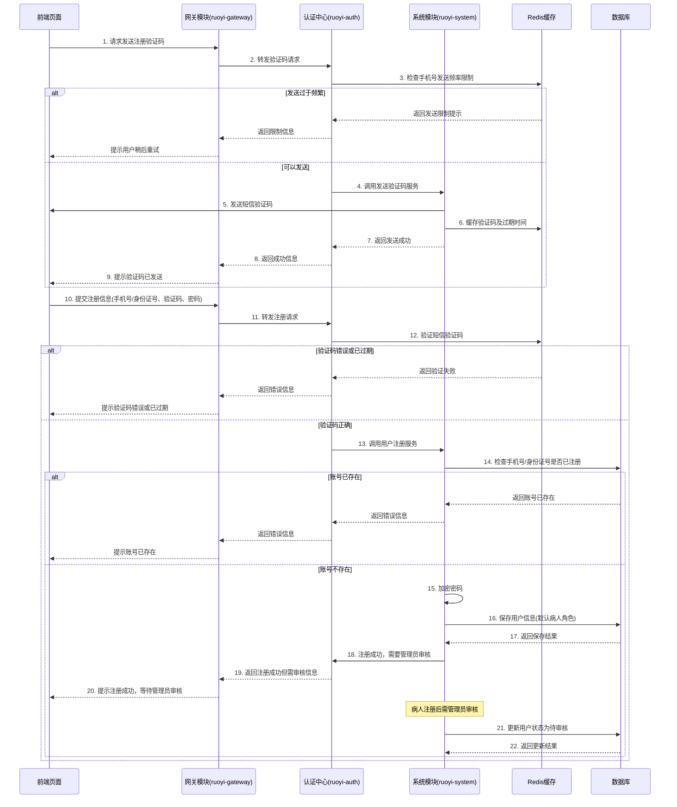
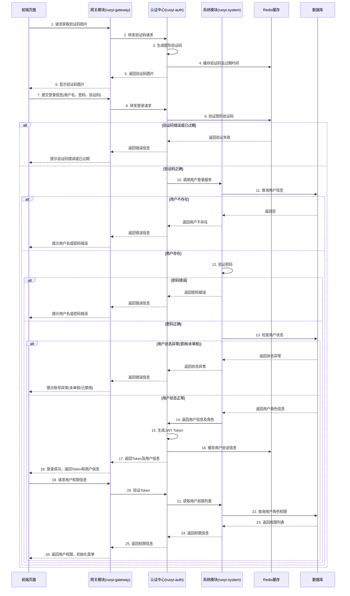
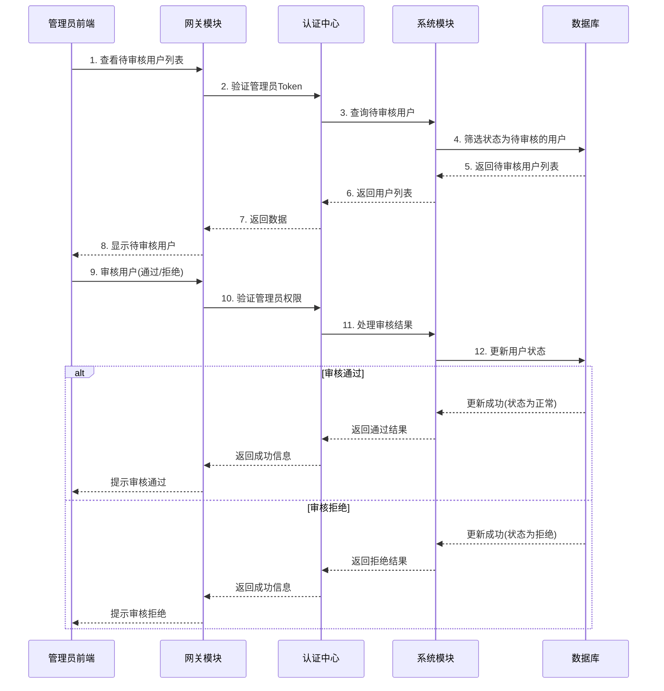
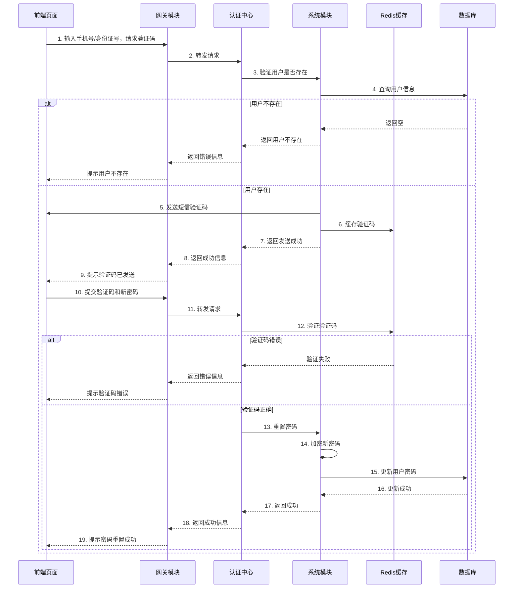

# 医院预约挂号系统 - 注册与登录流程

## 1. 病人注册流程

```mermaid
sequenceDiagram
    participant Client as 前端页面
    participant Gateway as 网关模块(ruoyi-gateway)
    participant Auth as 认证中心(ruoyi-auth)
    participant System as 系统模块(ruoyi-system)
    participant Redis as Redis缓存
    participant DB as 数据库
    
    Client->>Gateway: 1. 请求发送注册验证码
    Gateway->>Auth: 2. 转发验证码请求
    Auth->>Redis: 3. 检查手机号发送频率限制
    alt 发送过于频繁
        Redis-->>Auth: 返回发送限制提示
        Auth-->>Gateway: 返回限制信息
        Gateway-->>Client: 提示用户稍后重试
    else 可以发送
        Auth->>System: 4. 调用发送验证码服务
        System->>Client: 5. 发送短信验证码
        System->>Redis: 6. 缓存验证码及过期时间
        System-->>Auth: 7. 返回发送成功
        Auth-->>Gateway: 8. 返回成功信息
        Gateway-->>Client: 9. 提示验证码已发送
    end
    
    Client->>Gateway: 10. 提交注册信息(手机号/身份证号、验证码、密码)
    Gateway->>Auth: 11. 转发注册请求
    Auth->>Redis: 12. 验证短信验证码
    alt 验证码错误或已过期
        Redis-->>Auth: 返回验证失败
        Auth-->>Gateway: 返回错误信息
        Gateway-->>Client: 提示验证码错误或已过期
    else 验证码正确
        Auth->>System: 13. 调用用户注册服务
        System->>DB: 14. 检查手机号/身份证号是否已注册
        alt 账号已存在
            DB-->>System: 返回账号已存在
            System-->>Auth: 返回错误信息
            Auth-->>Gateway: 返回错误信息
            Gateway-->>Client: 提示账号已存在
        else 账号不存在
            System->>System: 15. 加密密码
            System->>DB: 16. 保存用户信息(默认病人角色)
            DB-->>System: 17. 返回保存结果
            System->>Auth: 18. 注册成功，需要管理员审核
            Auth-->>Gateway: 19. 返回注册成功但需审核信息
            Gateway-->>Client: 20. 提示注册成功，等待管理员审核
            
            Note over System: 病人注册后需管理员审核
            
            System->>DB: 21. 更新用户状态为待审核
            DB-->>System: 22. 返回更新结果
        end
    end
```

## 2. 用户登录流程

```mermaid
sequenceDiagram
    participant Client as 前端页面
    participant Gateway as 网关模块(ruoyi-gateway)
    participant Auth as 认证中心(ruoyi-auth)
    participant System as 系统模块(ruoyi-system)
    participant Redis as Redis缓存
    participant DB as 数据库
    
    Client->>Gateway: 1. 请求获取验证码图片
    Gateway->>Auth: 2. 转发验证码请求
    Auth->>Auth: 3. 生成图形验证码
    Auth->>Redis: 4. 缓存验证码及过期时间
    Auth-->>Gateway: 5. 返回验证码图片
    Gateway-->>Client: 6. 显示验证码图片
    
    Client->>Gateway: 7. 提交登录信息(用户名、密码、验证码)
    Gateway->>Auth: 8. 转发登录请求
    Auth->>Redis: 9. 验证图形验证码
    alt 验证码错误或已过期
        Redis-->>Auth: 返回验证失败
        Auth-->>Gateway: 返回错误信息
        Gateway-->>Client: 提示验证码错误或已过期
    else 验证码正确
        Auth->>System: 10. 调用用户登录服务
        System->>DB: 11. 查询用户信息
        alt 用户不存在
            DB-->>System: 返回空
            System-->>Auth: 返回用户不存在
            Auth-->>Gateway: 返回错误信息
            Gateway-->>Client: 提示用户名或密码错误
        else 用户存在
            System->>System: 12. 验证密码
            alt 密码错误
                System-->>Auth: 返回密码错误
                Auth-->>Gateway: 返回错误信息
                Gateway-->>Client: 提示用户名或密码错误
            else 密码正确
                System->>DB: 13. 检查用户状态
                alt 用户状态异常(禁用/未审核)
                    DB-->>System: 返回状态异常
                    System-->>Auth: 返回状态异常
                    Auth-->>Gateway: 返回错误信息
                    Gateway-->>Client: 提示账号异常(未审核/已禁用)
                else 用户状态正常
                    DB-->>System: 返回用户角色信息
                    System->>Auth: 14. 返回用户信息及角色
                    Auth->>Auth: 15. 生成JWT Token
                    Auth->>Redis: 16. 缓存用户会话信息
                    Auth-->>Gateway: 17. 返回Token及用户信息
                    Gateway-->>Client: 18. 登录成功，返回Token和用户信息
                    
                    Client->>Gateway: 19. 请求用户权限信息
                    Gateway->>Auth: 20. 验证Token
                    Auth->>System: 21. 获取用户权限列表
                    System->>DB: 22. 查询用户角色权限
                    DB-->>System: 23. 返回权限列表
                    System-->>Auth: 24. 返回权限信息
                    Auth-->>Gateway: 25. 返回权限信息
                    Gateway-->>Client: 26. 返回用户权限，初始化菜单
                end
            end
        end
    end
```

## 3. 管理员审核病人注册流程

```mermaid
sequenceDiagram
    participant Admin as 管理员前端
    participant Gateway as 网关模块
    participant Auth as 认证中心
    participant System as 系统模块
    participant DB as 数据库
    
    Admin->>Gateway: 1. 查看待审核用户列表
    Gateway->>Auth: 2. 验证管理员Token
    Auth->>System: 3. 查询待审核用户
    System->>DB: 4. 筛选状态为待审核的用户
    DB-->>System: 5. 返回待审核用户列表
    System-->>Auth: 6. 返回用户列表
    Auth-->>Gateway: 7. 返回数据
    Gateway-->>Admin: 8. 显示待审核用户
    
    Admin->>Gateway: 9. 审核用户(通过/拒绝)
    Gateway->>Auth: 10. 验证管理员权限
    Auth->>System: 11. 处理审核结果
    System->>DB: 12. 更新用户状态
    alt 审核通过
        DB-->>System: 更新成功(状态为正常)
        System-->>Auth: 返回通过结果
        Auth-->>Gateway: 返回成功信息
        Gateway-->>Admin: 提示审核通过
    else 审核拒绝
        DB-->>System: 更新成功(状态为拒绝)
        System-->>Auth: 返回拒绝结果
        Auth-->>Gateway: 返回成功信息
        Gateway-->>Admin: 提示审核拒绝
    end
```

## 4. 密码找回流程

```mermaid
sequenceDiagram
    participant Client as 前端页面
    participant Gateway as 网关模块
    participant Auth as 认证中心
    participant System as 系统模块
    participant Redis as Redis缓存
    participant DB as 数据库
    
    Client->>Gateway: 1. 输入手机号/身份证号，请求验证码
    Gateway->>Auth: 2. 转发请求
    Auth->>System: 3. 验证用户是否存在
    System->>DB: 4. 查询用户信息
    alt 用户不存在
        DB-->>System: 返回空
        System-->>Auth: 返回用户不存在
        Auth-->>Gateway: 返回错误信息
        Gateway-->>Client: 提示用户不存在
    else 用户存在
        System->>Client: 5. 发送短信验证码
        System->>Redis: 6. 缓存验证码
        System-->>Auth: 7. 返回发送成功
        Auth-->>Gateway: 8. 返回成功信息
        Gateway-->>Client: 9. 提示验证码已发送
        
        Client->>Gateway: 10. 提交验证码和新密码
        Gateway->>Auth: 11. 转发请求
        Auth->>Redis: 12. 验证验证码
        alt 验证码错误
            Redis-->>Auth: 验证失败
            Auth-->>Gateway: 返回错误信息
            Gateway-->>Client: 提示验证码错误
        else 验证码正确
            Auth->>System: 13. 重置密码
            System->>System: 14. 加密新密码
            System->>DB: 15. 更新用户密码
            DB-->>System: 16. 更新成功
            System-->>Auth: 17. 返回成功
            Auth-->>Gateway: 18. 返回成功信息
            Gateway-->>Client: 19. 提示密码重置成功
        end
    end
```